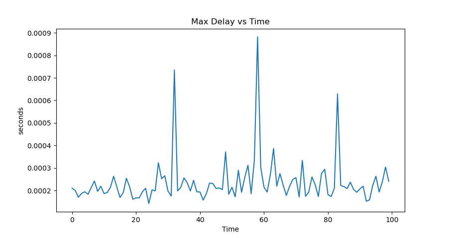

# CS425 MP0 report

###### group member: Xuan Tang(xuant4), Hengyu Liu(hengyu2)

###### cluster number: 34

#### git repo&commit id

https://gitlab.engr.illinois.edu/xuant4/cs425.git

commit ID:  bc9b83d8ba44d59577c85807f7507dd1be16ae87

#### code instructions

+ descriptions

  While running logger.go and node.go given input from generator.py, functions in logger.go will write preprocessed data into 2 files, one of them are used to stored bandwidth value, another one to store the network latency value, to make sure gaph generator can get data for each second, we used time ticker to make sure we will only output one value in 1 second. We used channel in go to send value between different go-routines, and all latency values will be passed into 4 functions to calculate the min, max, average and  90th percentile value, then write them in one line in a txt file, the same procedure for the bandwidth. When generating graphs, we are using the only the first 100 lines of data to generate 5 figures verses time by graph_generator.py.

+ include 

  + generator.py graph_generator.py
  + logger.go node.go 
  + bandwidth.txt time_logger.txt
  + Makefile

+ makefile 

  ```
  make # compile the logger.go and node.go to binary files
  make clean # rm the binary file logger and node
  ```

+ start the server

  ```
  ./logger <ip_addr> 1234
  ```

+ adding nodes 

  ``` 
  ./node node1 <ip_addr> 1234
  ./node node2 <ip_addr> 1234
  ...
  ```

+ start generating using generator.py

  + 3 nodes 2 hz evaluation

  + code instructions

    ``` 
    ./logger <ip_addr> 1234				#1234 is the port
    ./node node1 <ip_addr> 1234
    ./node node2 <ip_addr> 1234
    ./node node3 <ip_addr> 1234
    python3 -u generator.py 2 | ./node <node_name> <ip_addr> 1234
    ### After the datas in bandwidth.txt and time_logger.txt is more than 100 lines 
    ### we can generate the graphs using
    python3 graph_generator.py
    ```

  + 8 nodes 5 hz evaluation

  + code instructions

    ``` 
    ./logger <ip_addr> 1234			 #1234 is the port
    ./node node1 <ip_addr> 1234
    ./node node2 <ip_addr> 1234
    ./node node3 <ip_addr> 1234
    ./node node4 <ip_addr> 1234
    ./node node5 <ip_addr> 1234
    ./node node6 <ip_addr> 1234
    ./node node7 <ip_addr> 1234
    ./node node8 <ip_addr> 1234
    python3 -u generator.py 5 | ./node <node_name> <ip_addr> 1234
    ### After the datas in bandwidth.txt and time_logger.txt is more than 100 lines 
    ### we can generate the graphs using
    python3 graph_generator.py
    ```

+ graphs

  + 3 nodes 2 hz evaluation

  + P.S. Since we manually add the nodes, the bandwidth is ramping up for the first 10 secs, but in our own document graph, we deleted the first 10 second data.

  + Units: 

    + Bandwidth: Kbps
  
    + delay: s
  
  
    
  
    
  
    
  
    
  
    
  
  + 8 nodes 5 hz evaluation
  
  + P.S. Since we manually add the nodes, the bandwidth is ramping up for the first 10 secs, but in our own document graph, we deleted the first 10 second data.
  
  + Units: 
  
    + Bandwidth: Kbps
  
    + Delay: s
  
  
    
  
    
  
    
  
    
  
    
  


